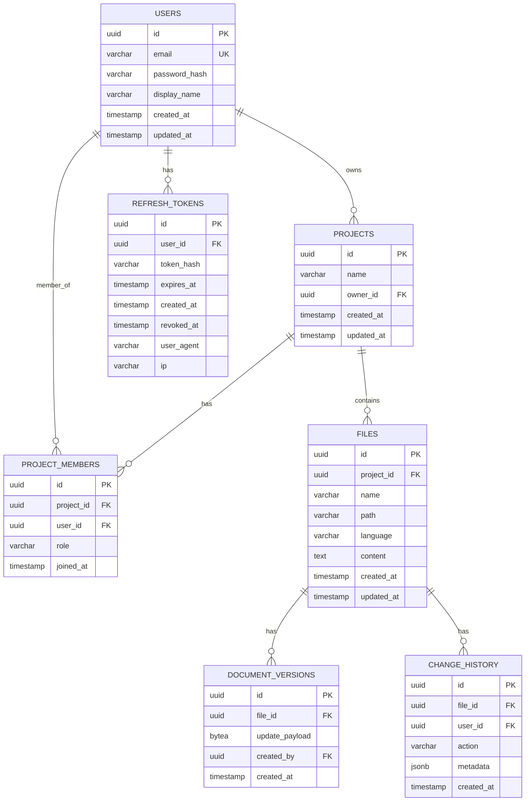

# CodeStream — техническое проектирование MVP backend

> «Figma для кода»: онлайн-редактор кода с совместным редактированием в реальном времени. Backend-фокус.

---

## 1. Стек

- **Язык**: Go 1.22+
- **Web-фреймворк**: Gin
- **ORM**: GORM
- **БД**: PostgreSQL
- **Кэш / pub-sub**: Redis
- **WebSocket**: gorilla/websocket
- **JWT**: golang-jwt/jwt/v5
- **Password hashing**: bcrypt
- **Migrations**: golang-migrate
- **Logging**: log/slog
- **Конфигурация**: переменные окружения
- **Docker + Docker Compose**
- **CI/CD**: GitHub Actions

Подробное обоснование: [docs/stack.md](stack.md).

---

## 2. Подход к collaborative editing

### Сравнение OT и CRDT

| Подход | Суть | Плюсы | Минусы | Verdict |
|--------|------|-------|--------|---------|
| **OT** | Операции трансформируются на сервере относительно текущей версии. | Меньше трафик, простые клиенты. | Сложная серверная логика, центральный сервер, легко ошибиться. | Возможна, но рискованна для solo-разработчика. |
| **CRDT** | Каждый клиент/сервер имеет копию структуры; конфликты разрешаются математически. | Простая серверная логика, reconnect «из коробки», распределённость. | Больше трафик, рост истории. | ✅ **Выбран** — проще и корректнее для MVP. |

### Выбор: CRDT с Yjs на клиенте

Для MVP выбран подход, при котором Go-сервер **не интерпретирует CRDT-структуру**, а лишь хранит и ретранслирует бинарные CRDT-updates. Это самый простой и корректный путь, поскольку:

1. Yjs — де-фacto стандарт CRDT для редактора, имеет `y-monaco` для Monaco Editor.
2. В Go нет mature библиотеки для CRDT-интерпретации; её написание выходит за рамки MVP.
3. Математические гарантии CRDT дают сходимость даже при дублировании/задержках сообщений.

### Как это работает на сервере

1. **Хранение состояния**:
   - `files.content` является **canonical source of truth** и хранит **CRDT snapshot** (binary Yjs update), а не plain text.
   - Поле `files.content_type` указывает формат хранимого состояния: `yjs-binary` (основной) или `text-derive` (деривативный plain text).
   - Plain text генерируется деривативно на клиенте (или, при необходимости, на сервере) только для поиска/отображения, но никогда не является источником правды.
   - При перезапуске состояние восстанавливается из `files.content` snapshot и/или последовательности `document_versions.update_payload`.

2. **Применение операций**:
   - Клиент применяет изменения локально в `Y.Doc`.
   - Изменение кодируется как `Uint8Array`, Base64-строка, отправляется на сервер как `doc:update`.
   - Сервер сохраняет `update_payload` в `document_versions` и рассылает его другим клиентам в комнате `file:<file_id>`.
   - Сервер **не трансформирует** update, только сохраняет и ретранслирует.

3. **Порядок и консистентность**:
   - CRDT гарантирует сходимость независимо от порядка доставки.
   - Внутри одного WebSocket-соединения сообщения доставляются FIFO.
   - Для критичных мета-операций (rename, delete) используются REST + оптимистичные lock-токены / last-write-wins.

4. **Reconnect**:
   - Клиент при reconnect отправляет `join:file` со своим `stateVector` (base64-encoded `Uint8Array` из Yjs).
   - Сервер возвращает `doc:sync` с недостающим состоянием либо полным snapshot.
   - Клиент применяет полученный update.
   - **Почему не timestamp**: CRDT-state определяется не временной меткой, а множеством применённых операций. `stateVector` содержит актуальные clock-значения и позволяет вычислить недостающие updates. Timestamp не может служить версией документа.

---

## 3. Схема базы данных

### ER-диаграмма (Mermaid)



### Таблицы

#### `users`

| Поле | Тип | Описание |
|------|-----|----------|
| `id` | UUID, PK | Уникальный идентификатор. |
| `email` | VARCHAR(255), UNIQUE | Почта. |
| `password_hash` | VARCHAR(255) | Хеш пароля (bcrypt). |
| `display_name` | VARCHAR(100) | Имя в интерфейсе. |
| `created_at` | TIMESTAMP | Дата регистрации. |
| `updated_at` | TIMESTAMP | Дата обновления. |

**Индексы:** `email` (unique).

#### `projects`

| Поле | Тип | Описание |
|------|-----|----------|
| `id` | UUID, PK | Уникальный идентификатор. |
| `name` | VARCHAR(255) | Название проекта. |
| `owner_id` | UUID, FK → users | Владелец. |
| `created_at` | TIMESTAMP | Дата создания. |
| `updated_at` | TIMESTAMP | Дата обновления. |

**Индексы:** `owner_id`.

#### `project_members`

| Поле | Тип | Описание |
|------|-----|----------|
| `id` | UUID, PK | Уникальный идентификатор. |
| `project_id` | UUID, FK → projects | Проект. |
| `user_id` | UUID, FK → users | Пользователь. |
| `role` | VARCHAR(20) | `owner`, `editor`, `viewer`. |
| `joined_at` | TIMESTAMP | Дата добавления. |

**Индексы:** уникальный `(project_id, user_id)`, `project_id`, `user_id`.

#### `files`

| Поле | Тип | Описание |
|------|-----|----------|
| `id` | UUID, PK | Уникальный идентификатор. |
| `project_id` | UUID, FK → projects | Проект. |
| `name` | VARCHAR(255) | Имя файла. |
| `path` | VARCHAR(500) | Путь внутри проекта. |
| `language` | VARCHAR(50) | Язык. |
| `content` | BYTEA | CRDT snapshot (binary Yjs update). Canonical source of truth. |
| `content_type` | VARCHAR(20) | `yjs-binary` или `text-derive`. |
| `created_at` | TIMESTAMP | Дата создания. |
| `updated_at` | TIMESTAMP | Дата обновления. |

**Индексы:** уникальный `(project_id, path)`, `project_id`.

#### `document_versions`

| Поле | Тип | Описание |
|------|-----|----------|
| `id` | UUID, PK | Уникальный идентификатор. |
| `file_id` | UUID, FK → files | Файл. |
| `update_payload` | BYTEA | CRDT-update (Yjs). |
| `created_by` | UUID, FK → users | Автор изменения. |
| `created_at` | TIMESTAMP | Время версии. |

**Индексы:** `file_id`, `created_at`.

#### `change_history`

| Поле | Тип | Описание |
|------|-----|----------|
| `id` | UUID, PK | Уникальный идентификатор. |
| `file_id` | UUID, FK → files | Файл. |
| `user_id` | UUID, FK → users | Пользователь. |
| `action` | VARCHAR(50) | Действие: `insert`, `delete`, `rename`, etc. |
| `metadata` | JSONB | Дополнительные данные (например, позиция, длина). |
| `created_at` | TIMESTAMP | Время действия. |

**Индексы:** `file_id`, `created_at`, `user_id`.

#### `refresh_tokens`

| Поле | Тип | Описание |
|------|-----|----------|
| `id` | UUID, PK | Уникальный идентификатор. |
| `user_id` | UUID, FK → users | Пользователь. |
| `token_hash` | VARCHAR(255), UNIQUE | Хеш refresh-токена. |
| `expires_at` | TIMESTAMP | Срок действия. |
| `created_at` | TIMESTAMP | Дата создания. |
| `revoked_at` | TIMESTAMP, nullable | Дата отзыва. |
| `user_agent` | VARCHAR(255), nullable | User-Agent клиента. |
| `ip` | VARCHAR(45), nullable | IP-адрес клиента. |

**Индексы:** `user_id`, `token_hash` (unique), `expires_at`.

---

## 4. High-level архитектура

```
┌─────────────────────────────────────────────────────────────┐
│                        Клиент (React + Monaco + Yjs)         │
│  ┌─────────────┐  ┌─────────────┐  ┌─────────────────────┐ │
│  │ Monaco Ed.  │  │  y-monaco   │  │ WebSocket клиент    │ │
│  └────────────┘  └──────┬──────┘  └──────────┬────────────┘ │
│         │                │                   │              │
│         └────────────────┴───────────────────┘              │
│                          WebSocket                          │
└─────────────────────────────────────────────────────────────┘
                                  │
                                  ▼
┌─────────────────────────────────────────────────────────────┐
│                     API Gateway (Gin)                        │
│  ┌─────────────┐  ┌─────────────┐  ┌─────────────────────┐   │
│  │ REST API    │  │ Auth (JWT)  │  │ WebSocket Gateway   │   │
│  │ /projects   │  │             │  │ (gorilla/websocket)│   │
│  │ /files      │  │             │  │                     │   │
│  └─────────────  └─────────────┘  └─────────┬───────────┘   │
│                                              │                │
│  ┌─────────────────┐ ┌─────────────────┐ ┌───┴────────┐      │
│  │ Room Manager    │ │ Document State  │ │ Presence   │      │
│  │ (in-memory)     │ │ Manager (Yjs)   │ │ Manager    │      │
│  └─────────────────┘ └─────────────────┘ └────────────┘      │
└──────────────────────────────────────────────────┬───────────┘
                                                   │
                    ┌──────────────┐      ┌──────────────────┐
                    │  PostgreSQL  │      │      Redis       │
                    │  (metadata)  │      │ (presence,       │
                    └──────────────      │ pub/sub, rooms)  │
                                         └──────────────────┘
```

### Компоненты

1. **REST API (Gin)**: управление пользователями, проектами, файлами; JWT-аутентификация.
2. **WebSocket Gateway (gorilla/websocket)**: upgrade HTTP, маршрутизация сообщений, управление соединениями.
3. **Room Manager**: in-memory карта `file_id → set(conn_id)`; добавление/удаление соединений; broadcast.
4. **Document State Manager**: хранит/сохраняет CRDT-updates; обновляет snapshot в `files.content` (binary Yjs update); при создании snapshot компактизирует `document_versions`.
5. **Presence Manager**: Redis для хранения онлайн-статуса пользователей.
6. **PostgreSQL**: мета-информация, snapshots, история.
7. **Redis**: presence, pub/sub, rate-limit.

### Поток данных при редактировании

1. Пользователь A вводит символ в Monaco.
2. `y-monaco` генерирует CRDT-update.
3. Клиент отправляет `doc:update` по WebSocket.
4. Сервер сохраняет `update_payload` в `document_versions`.
5. Сервер рассылает `doc:update` всем остальным в `file:<file_id>`.
6. Остальные клиенты применяют update к своим `Y.Doc`.

---

## 5. WebSocket-протокол

### Комнаты

- `file:<file_id>` — совместное редактирование файла.
- `project:<project_id>` — presence и проектные события.

### Сообщения клиент → сервер

| Тип | Описание |
|-----|----------|
| `join:file` | Присоединиться к файлу. |
| `leave:file` | Покинуть файл. |
| `doc:update` | CRDT-update. |
| `presence:update` | Обновить статус/курсор. |

### Сообщения сервер → клиент

| Тип | Описание |
|-----|----------|
| `doc:sync` | Полное состояние документа (на reconnect). |
| `doc:update` | Broadcast CRDT-update. |
| `presence:update` | Обновление presence. |
| `user:joined` / `user:left` | Системные события. |

### Формат операций редактирования

CRDT-update — это Base64-закодированный `Uint8Array`, который интерпретируется только клиентом (Yjs). Сервер хранит/ретранслирует его как opaque blob.

```json
{
  "event": "doc:update",
  "data": {
    "fileId": "550e8400-e29b-41d4-a716-446655440000",
    "update": "AAABAA..."
  }
}
```

### Аутентификация WebSocket

JWT передаётся в query-параметре:

```
wss://api.example.com/ws?token=<jwt>
```

- Сервер проверяет токен при `Upgrade`.
- После успешной проверки соединение считается аутентифицированным.
- **Риск**: токен может попасть в access-логи прокси/сервера. Для MVP это допустимо; в продакшене рассматривать `Sec-WebSocket-Protocol` или short-lived WS ticket.

### Порядок операций и reconnect

- CRDT обеспечивает сходимость независимо от порядка доставки.
- В рамках одного соединения сообщения FIFO.
- **Почему не timestamp**: CRDT-state определяется не временной меткой, а множеством применённых операций. `stateVector` из Yjs содержит актуальные clock-значения и позволяет серверу вычислить недостающие updates. Timestamp не может использоваться как версия документа.
- При reconnect:
  1. Клиент подключается по WebSocket с JWT в query-параметре.
  2. Отправляет `join:file` со своим `stateVector` (base64-encoded `Uint8Array`).
  3. Сервер отвечает `doc:sync` с недостающим состоянием либо полным snapshot.
  4. Клиент применяет `doc:sync`.

### Примеры JSON-сообщений

**Авторизация WebSocket:**
JWT передаётся в query-параметре `?token=<jwt>`:

```
wss://api.example.com/ws?token=eyJhbGciOiJIUzI1NiIsInR5cCI6IkpXVCJ9...
```

**Присоединение к файлу:**

```json
{
  "event": "join:file",
  "data": {
    "fileId": "550e8400-e29b-41d4-a716-446655440000",
    "stateVector": "AQABAA..."
  }
}
```

**Синхронизация состояния:**

```json
{
  "event": "doc:sync",
  "data": {
    "fileId": "550e8400-e29b-41d4-a716-446655440000",
    "state": "AAABAA...",
    "stateVector": "AQABAA..."
  }
}
```

**CRDT-update:**

```json
{
  "event": "doc:update",
  "data": {
    "fileId": "550e8400-e29b-41d4-a716-446655440000",
    "update": "AAABAg...",
    "userId": "6ba7b810-9dad-11d1-80b4-00c04fd430c8"
  }
}
```

**Presence:**

```json
{
  "event": "presence:update",
  "data": {
    "userId": "6ba7b810-9dad-11d1-80b4-00c04fd430c8",
    "fileId": "550e8400-e29b-41d4-a716-446655440000",
    "status": "online",
    "cursor": { "line": 10, "column": 5 }
  }
}
```

---

## 6. Этапы реализации MVP backend

| # | Этап | Цель | Артефакты | Критерий готовности | Зависимости |
|---|------|------|-----------|---------------------|-------------|
| 1 | **Bootstrap** | Подготовить окружение, запустить Go + Gin + Docker Compose с PostgreSQL и Redis. | `docker-compose.yml`, базовый `main.go`, health-check endpoint. | `docker compose up` запускает backend, БД и Redis; `/health` возвращает OK. | — |
| 2 | **Auth** | Регистрация, логин, JWT, защита endpoints. | Модели `users`, auth handlers, middleware, миграции. | Тесты регистрации/логина проходят; защищённые endpoints требуют JWT. | 1 |
| 3 | **Проекты и файлы (REST)** | CRUD для `projects`, `project_members`, `files`. | REST handlers, GORM модели, тесты. | Postman/curl сценарии CRUD работают. | 2 |
| 4 | **WebSocket foundation** | Upgrade соединений, подключение к комнате, ping/pong. | WebSocket gateway, room manager, базовая аутентификация на WS. | Клиент (или тест) подключается к WS, присоединяется к `file:<id>`, получает `user:joined`. | 2 |
| 5 | **Collaborative editing** | CRDT-update сохраняется и ретранслируется. | `doc:update` handler, сохранение в `document_versions`, broadcast. | Два WS-клиента видят изменения друг друга; update сохраняется в БД. | 3, 4 |
| 6 | **Версии / persistence** | Snapshot в `files.content`, восстановление состояния, история изменений, компактификация `document_versions`. | `DocumentStateManager`, periodic snapshot, retention policy для `document_versions`, `change_history` записи. | После restart сервера документ восстанавливается из snapshot + версий; старые версии удаляются, оставляя N последних. | 5 |
| 7 | **Presence** | Redis presence, список активных пользователей. | Presence manager, `presence:update` события. | При заходе/выходе пользователя остальные получают presence-update. | 4 |
| 8 | **CI/CD + docs** | GitHub Actions, lint, тесты, Docker build. | `.github/workflows/ci.yml`, README, финальные docs. | CI проходит зелёным. | 1–7 |

---

## 7. Открытые вопросы и риски

1. **CRDT на Go**: Yjs — JS-only. Go-сервер работает с CRDT opaquely. Если потребуется серверная логика (например, валидация), нужна Go-библиотека CRDT или WASM-интеграция Yjs.
2. **Авторизация WebSocket**: JWT-проверка при `Upgrade` — реализовать через query-param или `Sec-WebSocket-Protocol`.
3. **Масштабируемость**: in-memory Room Manager ограничен одним процессом. Для нескольких инстансов нужен Redis-backed pub/sub + sticky sessions.
4. **Персистенция и компактификация**: snapshot сохраняется каждые 30 секунд и/или при закрытии комнаты. При создании нового snapshot старые `document_versions` компактизируются: оставляется N последних версий для истории, остальные удаляются (или архивируются). Сам snapshot сохраняется в `files.content` (binary Yjs update) с `content_type = 'yjs-binary'`.
5. **Конфликты мета-данных**: rename/удаление файла — предложен last-write-wins. При необходимости можно добавить оптимистичные lock-токены.
